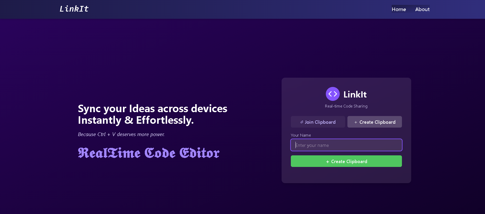
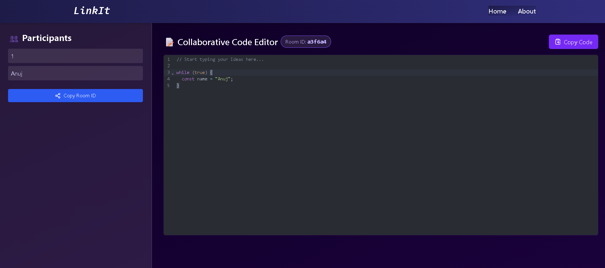

# ⚡ LinkIt — Realtime Collaborative Code Editor ✍️

A blazing-fast, real-time collaborative code editor built using **React**, **Spring Boot**, **WebSockets (STOMP + SockJS)**, and **CodeMirror**. Instantly share your code with others, collaborate on the same page, and sync participants across devices like magic. ✨

---

## 🚀 Features

- 👥 **Create or Join Rooms** — Simple clipboard-like collaboration.
- 🧠 **Real-time Code Sync** — Instantly updates code across participants using STOMP over WebSockets.
- 🧑‍🤝‍🧑 **Live Participant List** — Shows who is currently in the room.
- 🔁 **Auto-restore Room** — Page reload doesn’t break the session.
- 📦 **File Table Support** — Upload and display files collaboratively.
- ❌ **Auto-Remove Participants** — Leaves are detected and synced live.
- 🗑️ **Auto-Delete Room** — Room is deleted when the last participant exits.
- 📋 **Copy to Clipboard** — Room ID and code can be copied instantly.

---

## 🛠️ Tech Stack

### 💻 Frontend (React + Tailwind)
- **React** with hooks and functional components
- **React Router DOM** for routing
- **CodeMirror 6** for editor
- **SockJS + STOMP** for real-time messaging
- **Tailwind CSS** for styling
- **Toastify** for notifications
- **Axios** for API calls

### 🔧 Backend (Spring Boot)
- **Spring WebSocket** + **STOMP**
- **Spring Data JPA** + H2/MySQL
- **REST APIs** for room management
- **Auto-broadcast participants and code**

---

## 📸 Screenshots

| Home Page | Code Room |
|-----------|-----------|
|  |  |

---

## 🧩 Folder Structure

